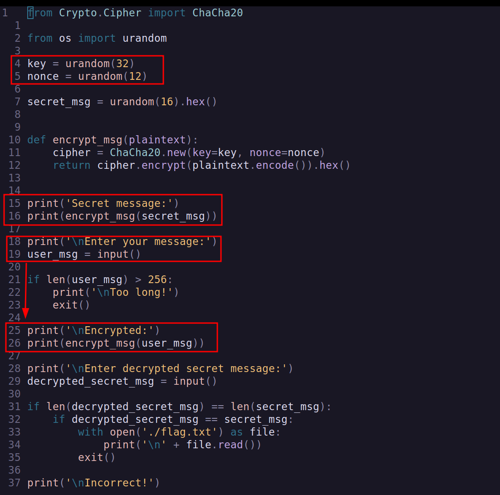
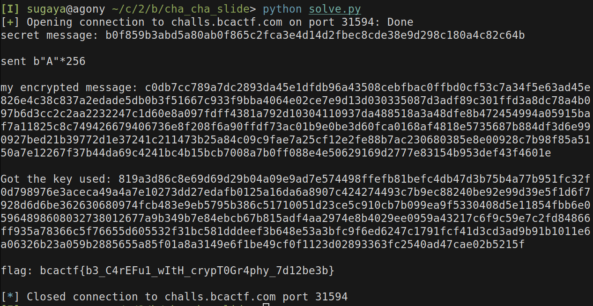

# Cha-Cha Slide - 100 points
## Description
I made this cool service that lets you protect your secrets with state-of-the-art encryption. It's so secure that we don't even tell you the key we used to encrypt your message!

### Given assets
- `server.py` - source of the script running at the server
- `nc challs.bcactf.com 31594` - string for connection

---
`server.py`


The key part here is that the key and the nonce are being reused to encrypt the
`secret_msg` and `user_msg`.

Researching online and reading this 
[Real Smooth Writeup by FR33_T34M_Z](https://ctftime.org/writeup/37972)
we can read that Cha-Cha encryption generates a encrypted byte
for each byte in the msg to be encrypted `xoring` a cleartext byte with a key byte.

I didnt fully understand but had a feeling that I had to discover the key.
Since the encrypted message is generated with the following,

```python
enc_msg = ""
for i in range(len(msg)):
    enc_msg += plain_msg[i] ^ key[i] 
```

to get the key, we should `xor` the enc_msg with the plain_msg.
since the key is used for both encryptions, we can get the key using our msg, 
and with the key in hands, discover the secret msg.

```python
key = ""
for i in range(len(enc_msg)):
    key += enc_msg[i] ^ plain_msg[i]
```

with the key in hands,

```python
plaintext_secret_msg = ""
for i in range(len(secret_msg)):
    plaintext_secret_msg += key[i] ^ secret_msg[i]
```

we recover the plaintext secret_msg.

Here's the code used.
```python
from pwn import *

io = remote('challs.bcactf.com', 31594)

line = io.recvuntil(b'Secret message:\n')

b_secret_message = io.recvline()
secret_message = b_secret_message.decode('UTF-8')[:-1]
print(f"secret message: {secret_message}")
print()

line = io.recvuntil(b'your message:\n')
io.sendline(b"A"*256)
print("sent b\"A\"*256")
print()

io.recvuntil(b'Encrypted:\n')
b_my_encrypted_msg = io.recvline()
my_encrypted_msg = b_my_encrypted_msg.decode('UTF-8')[:-1]
print(f"my encrypted message: {my_encrypted_msg}")
print()


# discover key
payload = "A"*256
key = ""
for i in range(0, len(my_encrypted_msg),2):
    # print(hex(int(my_encrypted_msg[i:i+2],16) ^ ord("A")))
    key += "{:02x}".format(int(my_encrypted_msg[i:i+2],16) ^ ord("A"))

print(f"Got the key used: {key}")
print()

# xor each byte of secret_msg with the each byte of the key_discovered
decrypted_secret_msg = ""
for i in range(0, len(secret_message), 2):
    # print(hex(int(secret_message[i:i+2], 16) ^ int(key[i:i+2], 16)))
    decrypted_secret_msg += chr(int(secret_message[i:i+2], 16) ^ int(key[i:i+2], 16))

io.recvuntil(b'decrypted secret message:\n')
io.sendline(str.encode(decrypted_secret_msg))

_ = io.recvline()
flag = io.recvline()
print(f"flag: {flag.decode('UTF-8')[:-1]}")
print()
exit()
```

getting the flag,

