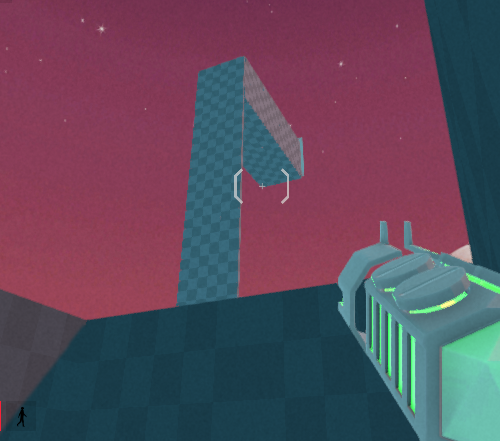
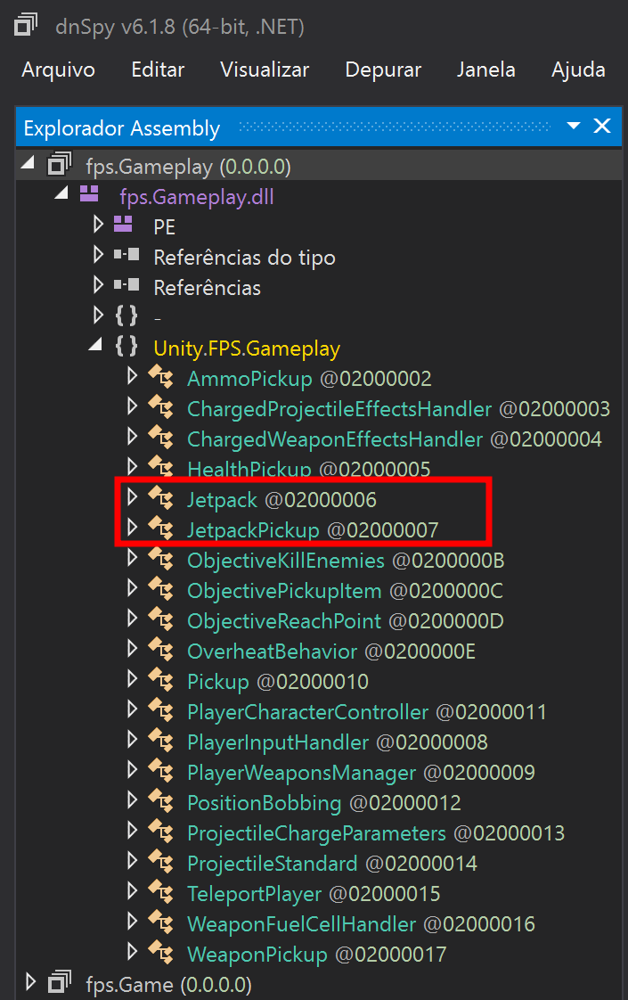

# FPS Frenzy - 75 points - 73 solves
## Description
My friend Timmy made a game at the MoCO (Master of Code Olympiad) in just 50 nanoseconds! He told me that he hid a secret text somewhere in the game and placed a bet that I would not solve it. I'm not good at games, so can you please find this text?

### Assets
`Windows` - Windows binary
`Linux` - Linux binary
`Mac` - Mac binary

---

First we looked at the directory of the game but I was not able to find anything
useful. Opening up the game, it was clear that it was made in Unity.

It was a simple FPS game, but in the commands something stood out, it seems that
there was a jetpack control (holding space while in air). But at trying to do so,
nothing happened.


I walked around the game, finished the level, but the level closed at a play again
dialog opened up. No jetpack for me!

Hinting towards it, even more, there was a room at the right side of the level that
was just TOO high.




THE JETPACK WAS REAL. IT MUST BE.

We had to enable it in some way, **to get up there**.

So I rushed at Google and typed "hacking Unity games", found a lot of tutorials on
dnSpy, some writeups, so I dived into it.

The first issue was to find which `.dll` to tinker. It seems that Unity Games uses
a kinda-C, kinda-machine-language, which we can reverse engineer back to readable
code using a tool like `dnSpy`.

First, we will be tinkering with the Managed directory, so create a backup and 
rename it.

Then open the folder into dnspy, and the first thing to do was to find which 
`.dll` handled the jetpack logic.


We found that the `fpsGameplay.dll` was the one containing the jetpack logic. But trying to edit it
and enabling it offered no success.



But in the PlayerCharacterController class was the `jumpForce` variable, using 9f.


Maybe I could increment drastically in order to jump super high and get up there.
I saw in the class that we had `fallDamage`, so I had to tinker with that too.
dnSpy showed some bugs, but we were able to deal with that.


final code:
```C#
this.jumpForce = 100f;
this.RecievesFallDamage = false;
```

Remember to save. And then fire up the game.

Results.


And then,


`bcactf{7H3_14w_of_c0S1nEs_4b723470334e}`
