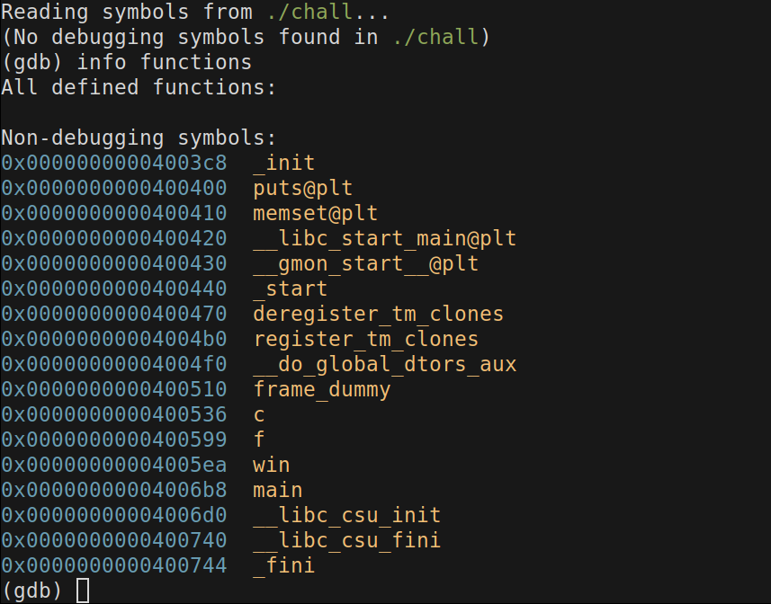
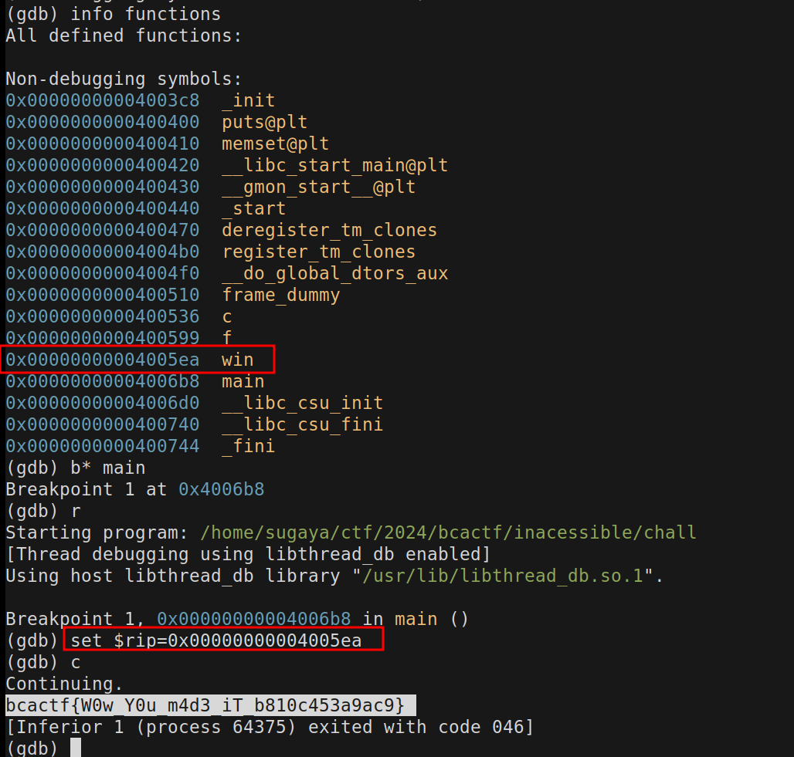

# Inacessible - 50 points
## Description
I wrote a function to generate the flag, but don't worry, I bet you can't access it!

---
We were provided with a binary, let's check it's defenses mechanisms.
```shell
pwn checksec chall
[*] '/home/sugaya/repos/write-ups/BCACTF-2024/inacessible/chall'
    Arch:     amd64-64-little
    RELRO:    No RELRO
    Stack:    No canary found
    NX:       NX enabled
    PIE:      No PIE (0x400000)
```

The name of the chall is hinting for a inacessible function in the source code.
As there is no canary, nor pie we should be able to overflow and redirect the
execution flow of the program.
Checking for functions in gdb.


We have to access the `win` function.

Disassemblying the `win` function, nothing seemed too eye-catching.
Disassemblying the `main` function, nothing seemed vulnerable, there was just
a `puts` call.

The next step was to run the function, so I breakpointed at main, and then
changed `$ip` to the `win`'s address.



And the flag just popped out.
It was way

`bcactf{W0w_Y0u_m4d3_iT_b810c453a9ac9}`
