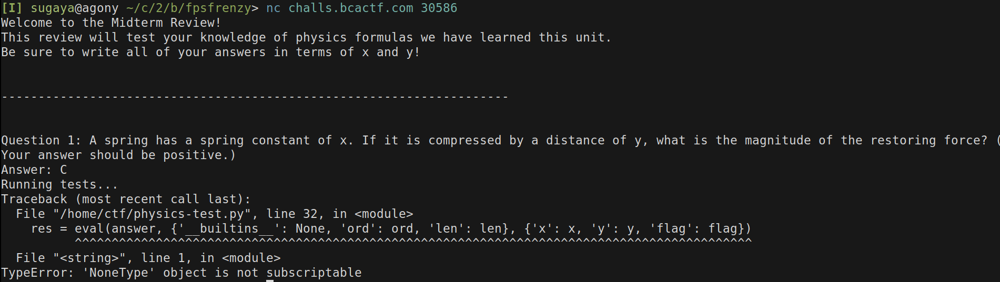

# Physics Test - 125 points - 106 solves
## Description
Help me get an A in Physics! My teacher made this review program for us.

### Assets
We are given only a connection string.

`nc challs.bcactf.com 30586`

---

## Recon



So, we have a variable named `flag` that is acessible. But the only functions 
available are `ord` and `len`. We can't call `print(flag)` for example.

Trying to call a specific char of the flag, we get this error.


Trying to remember my physics knowledge (google) I could get a correct answer.

That's the wrong answer message, and the correct answer message.


After a lot of thinking, acknowdledged that the answer should be an int, and that
there were only 3 questions, repeating themselves over and over.

So the plan:
- get the 3 correct answers
- add a sum(+) that results in 0 (would not change the result)
- sum the flag character and subtract with the guess character
- if correct answer, profit, if not, next guess character

Had to come up with a solution that I went from the flag char, to an int, to be
able to do the math.
Knowing that the first char of the message must be `"b"`. I tried a few things.

Stumbled across some banned chars.


After some time, I came up with this payload.


The bruteforce was possible.

So I had to script it. Used pwntools, and the most boring part was to parse the
responses correctly and make sure I was getting it right every time.

Script is at `crack_the_physics_test.py`

Main logic pseudo-code is
```python
i = 0
flag = ""
while flag[:-1] != "}":
    for c in chars:
        answer = right_answer + "+ord(flag[i])-ord(c)"
        r = io.sendl(answer)
        if "Good" in r:
            i = i + 1
            flag = flag + c
            break
```

After thousands of questions, the real answer that we were expecting.


`bcactf{yoU_p4ssED_b0ef030870ec18}`


