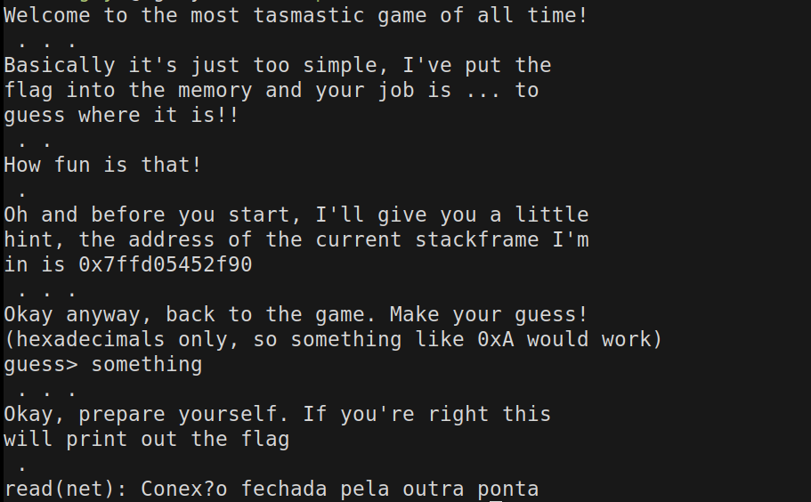
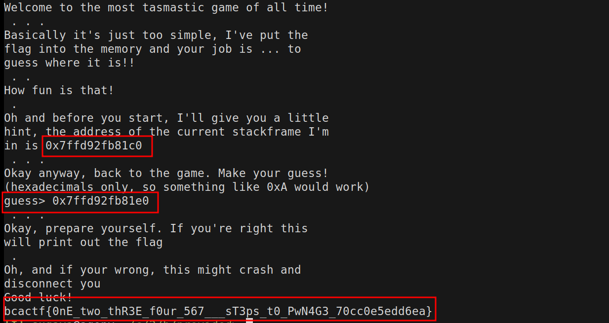

# Pwnage (EASY) - 100 points
We were provided with some C pseudo-code and a connection string for nc.
The whole pseudo-code is in the provided.c file.
The most interesting parts are:
```C
int main() {
    // Hint: how do these values get stored?
    void* first_var;
    char* guess;
    char flag[100];
    load_flag(flag, 100);

    puts("Oh and before you start, I'll give you a little");
    puts("hint, the address of the current stackframe I'm");
    printf("in is %p\n", (&first_var)[-2]);

    guess = read_pointer();

    puts("Okay, prepare yourself. If you're right this");
    puts("will print out the flag");
    printf("%s\n", guess);

    return 1;
}
```

So we have to inform the flag address and we are provided with the stackframe
address. 

Example connection.



Since the pseudo-code is hinting for the stack, we discard the possibility of 
the values being dinamycally allocated, since if these was true, they would be placed 
into the heap, and not on the stack.

As we are not provided with the executable, we have to guess if the system is 32 or 64 bits.
Supposing the system is 64 bits, the void *, and the char * should be 8 bytes, 16 bytes, 0x10.
So if we get the first_var's address, we should add 0x10 to get to the flag. We receive the first_var[-2] address though.

Simplifying, we it should look something like this:

```C
&(first_var[-1]) = first_var - 0x08
&(first_var[-2]) = first_var - 0x10
```

With the provided address being represented as `CURR`. The memory should look something like this:

```C
CURR        stackframe
CURR+0x08   something
CURR+0x10   first_var *
CURR+0x18   guess *
CURR+0x20   FLAG
```

So we have to inform the provided address + 0x20 to get the flag.



Voilá!

`bcactf{0nE_two_thR3E_f0ur_567___sT3ps_t0_PwN4G3_70cc0e5edd6ea}`

