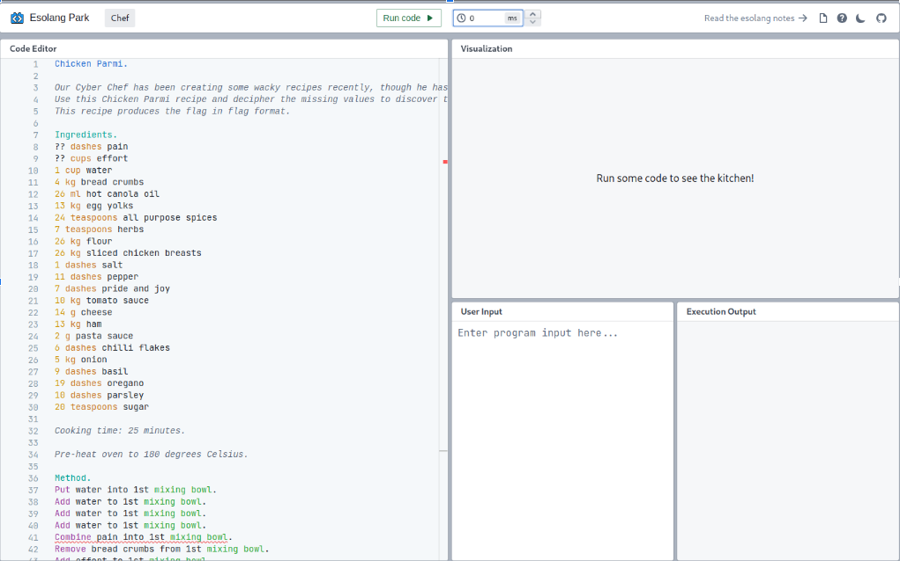
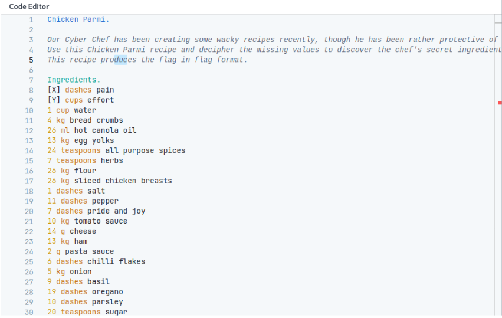
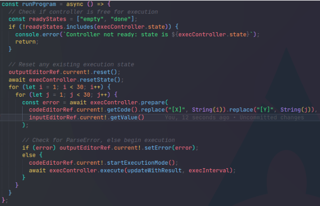
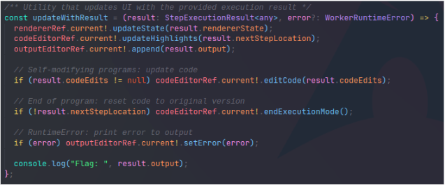
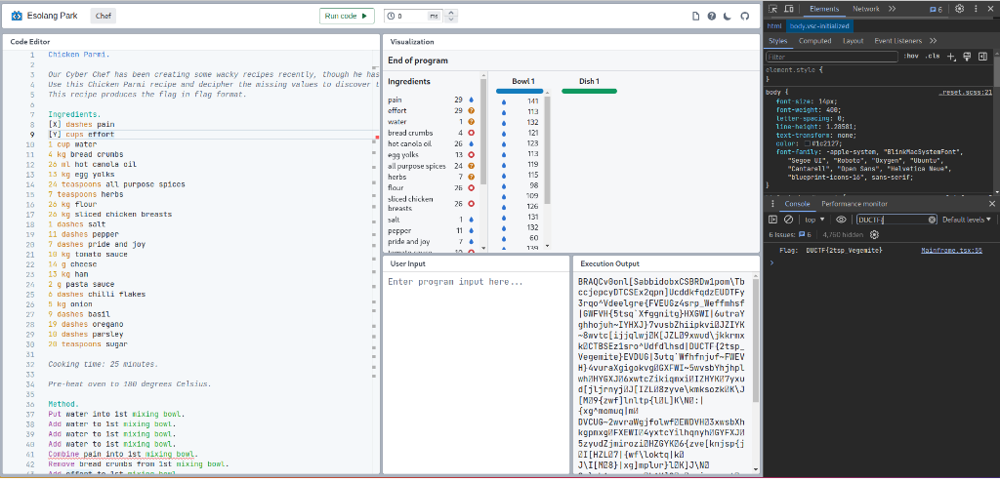

Wacky Recipe


Opening the recipe you can see it's an esolang called Chef https://esolangs.org/wiki/Chef. But we have 1 problem:
The recipe is incomplete, so the code does not run.
After finding a way to run Chef code, using: https://esolangpark.vercel.app/ide/chef we decided to pass random missing values to test what the code does. And apparently it prints something in the end

So our first guess is, “we can bruteforce those values until we print the flag”. This way we don’t need to understand how this esolang works. But how to do it? Most chef interpreters available on github do not work.
We had two values to bruteforce, X and Y

```c
X dashes pain
Y cups effort
```

First thing to do is to clone the project and run yarn install, then we can just paste the recipe in the Code Editor.



From there, we started to lookup which function is executed when we click on Run code and on this line https://github.com/nilaymaj/esolang-park/blob/main/ui/Mainframe.tsx#L73 we can see that this is the ref which holds the text value in the Code Editor section, so we basically had to replace all of the ?? with “unique” identifiers in order to make it easier when replacing the values, we have replaced the first set of question marks with [X] and the second one with [Y], like this:



And the magic starts when we add in two nested for loops to the runProgram function along with replacing the unique identifiers we’d set before.



We also added a console.log to the updateWithResult function so we can grab the flag once done.



Also we can reduce the execution interval from 20ms to 0ms and let it rip. After a while the flag pops up in the console.


