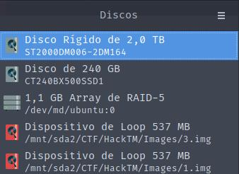

# RR

Points: **298 Points**

One of my drives failed and I need help recovering all my files. As far as I know the persons who have set up my PC used something like `R`eusing `A`ll of `I`nternal `D`isks.

The first thing we notice is the description saying that we are working with [RAID](https://pt.wikipedia.org/wiki/RAID).

After downloading the files, we have:
- 1.img ( 513mb )
- 2.img ( 0mb )
- 3.img ( 513mb )

So there is a missing disk! But don't worry, your hackerman is here.

This is **RAID** so let's mount these in the RAID array. We are going to use `gnome-disks` to mount the `1.img` and `3.img`.



After mounting we start it using:

```
sudo mdadm --assemble --scan --verbose
```

And baam, we now can access the partition with the flag in it


`HackTM{1bf965b6e23e5d2cb4bdfa67b6d8b0940b5a23e98b8593bb96a4261fb8a1f66a}`

