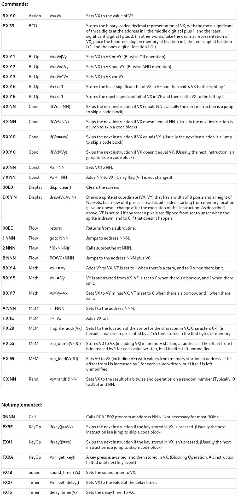

# CHIP 8/1

Points: **310 Points**

I made this sweet web-based chip8 emulator. The first 512 bytes of memory are protected!

<http://167.172.165.153:60003/>

Note: This challenge can be solved using only chip8 instructions.
Author: stackola

## What we were prompted with:
We were prompted with a board with 32x64 squares, all black. A text area where we could put our code, some buttons, including:

   Run		- run whole program at once
   Step 		- run one instruction
   Step10 	-  run ten instructions
   Reset 	- restart and clear screen.

We had a display showing some info too. 
Error display (usually empty); 
PC, showing at which adress our program counter is; 
I, a pointer that was used to do some operations like store an array or draw in the screen;
Cycles, a counter of how many instructions where executed until the moment; 
Last instruction, displaying which was the last instruction executed;
Stack, is always empty as there were no instructions to operate the stack;
Registers, a list of the registers from V0-V15.

### Docs section:

**The machine has a total of 4096 bytes of memory.
Your program begins at memory location 0x200 (512 in decimal)**
**The first and last 512 bytes of memory are protected and TOP SECRET.
You can use ; or ' for comments.
**



## Solve:
Despite the start and the end of the memory being protected the chall description hints us that the flag is at the beggining. 
To experiment with the CHIP8 we tried to draw somethings in the display.
We tried first direct jumping using 1000 and calling a subroutine 2000, but without success.
So the idea was to escape *I* to the first bytes somehow, since *I* was used to draw a (8,*n*) sprite in the instruction D *X* *Y* *n*, where *X* and *Y* where the index of the register to set the position of the drawing.
There was an interesting function used to draw chars at the display, F *X* 29. The char sprites were stored in the first bytes of the memory, so we went to check that out. Turns out that besides reading the sprites corresponding from *0* to *F*, we could point *I*  from adress 0x000 until 0x200, that's because the instruction FX29 works like this:
```
I = V[X]*5
```
and the registers could store a whole byte -> {0x00..0xFF}.
Okay, but what's next? We escaped the memory protection, so we tried to draw.
We were pretty excited but we ended up with something like this:


the payload should be in the repo as ```firstPayload.txt```

What was that after the letters? We were confused too.
We run the program over and over, step by step, ...

Then, suddenly one of our team members had an idea, the bits displayed in the screen were the flag letters! But they were stored as bytes not as a sprite. We kept drawing and making notes. For example, if we tried to draw a sprite and this image appeared:


We should translate it like, than map it to:
```
0000	0000 	-> 0x00
0000	0000 	-> 0x00
0000	0000 	-> 0x00
0100 	1000 	-> 0x48
0110	0001 	-> 0x61
0110	0011 	-> 0x63
0110	1011 	-> 0x6B
0101	0100  	-> 0x54
0100	1101 	-> 0x4D
0111	1011 	-> 0x7B
0110	0001 	-> 0x61
0011	0101 	-> 0x35
0011	0101 	-> 0x35
0110	0101 	-> 0x65
```
which turns out to be: HackTM{a55e
This abstraction was the hardest part of the challenge in my opinion, we stumbled in thinking in how the memory was organized, in how we should read the bits, lots of stuff, but it was an amazing experience to think and learn about the challenge.
The final payload was:
```
6010 	; V0=16
6100 	; V1=00
F029	; I = addr ( sprite[ V0 ] )
D11F	; draw( ( V1, V1 ), ( 8, 15 ) )
```
and we kept adding in V0 to get the rest of the flag.
The final flag was: HackTM{a55em8led_s0cks}