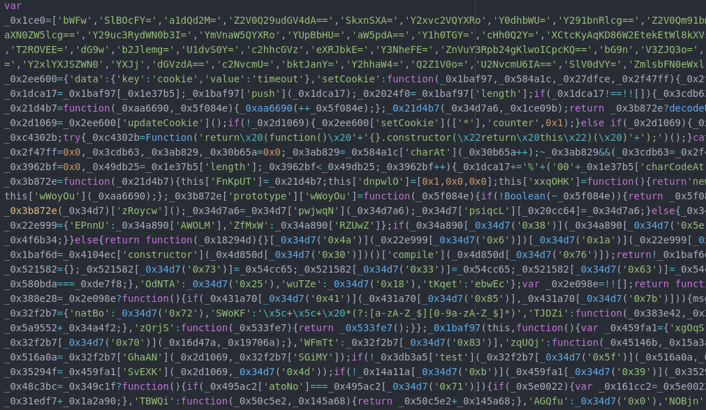
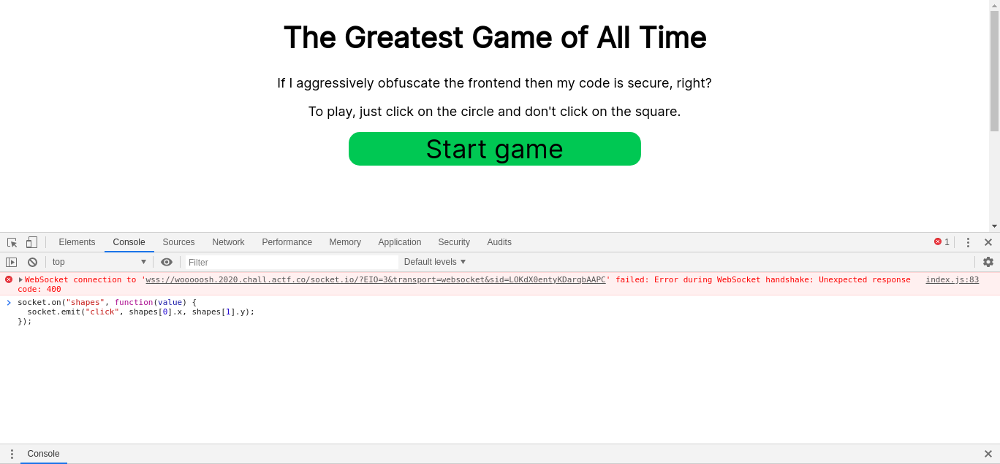
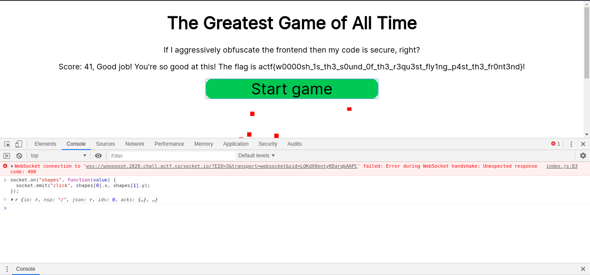

# Woooosh

**WEB** --- 130 points

Clam's tired of people hacking his sites so he spammed obfuscation on his [new game](https://woooosh.2020.chall.actf.co/). I have a feeling that behind that wall of obfuscated javascript there's still a vulnerable site though. Can you get enough points to get the flag? I also found the [backend source](./backend_source.js).

Second instance: [https://wooooosh.2020.chall.actf.co/](https://wooooosh.2020.chall.actf.co/)

Author: *aplet123*

---
# Where is the flag?

Looking at the server side code we can realize that we need to score at least 20 points to receive the flag.

```js
function endGame() {
    try {
        if (game) {
            if (game.score > 20) {
                client.emit(
                    "disp",
                    `Good job! You're so good at this! The flag is ${process.env.FLAG}!`
                );
            } else {
                client.emit(
                    "disp",
                    "Wow you're terrible at this! No flag for you!"
                );
            }
            game = null;
        }
    } catch (err) {
        console.log("err", err);
    }
}
```

But we have only 10 seconds to do this...

```js
client.on("start", function() {
    try {
        if (game) {
            client.emit("disp", "Game already started.");
        } else {
            game = {
                shapes: genShapes(),
                score: 0
            };
            game.int = setTimeout(endGame, 10000);
            client.emit("shapes", game.shapes);
            client.emit("score", 0);
        }
    } catch (err) {
        console.log("err", err);
    }
});
```

# The obfuscated code



We can't do much without deobfuscating this code a little bit, but if we look at the server side code, we can understand how the score is accepted.

```js
client.on("click", function(x, y) {
    try {
        if (!game) {
            return;
        }
        if (typeof x != "number" || typeof y != "number") {
            return;
        }
        if (dist(game.shapes[0].x, game.shapes[1].y, x, y) < 10) {
            game.score++;
        }
        game.shapes = genShapes();
        client.emit("shapes", game.shapes);
        client.emit("score", game.score);
    } catch (err) {
        console.log("err", err);
    }
});
```

Note that the circle has the x coord equals to the first shape, and the y coord equals to the second shape. Besides that, the server side computes the score in the click event, so the front needs to emit this event.

Now we have to work a bit in this smelly code...

# After reducing that smell...

After turning the code more readable, we are able to see how the front receives and how it sends the coordinates.

```js
socket.on("shapes", function(value) {
  shapes = value;
  drawShapes();
});

cGame.addEventListener("click", function(data) {
  var mouse = getCursorPosition(cGame, data);
  socket.emit("click", mouse[0], mouse[1]);
});
```

Now the only thing we need to do is add the *"shapes"* listener to send the correct coordinates in the exact moment we receive them.

```js
socket.on("shapes", function(value) {
  socket.emit("click", shapes[0].x, shapes[1].y);
});
```



Play!!!!!



---

**Flag:** actf{w0000sh_1s_th3_s0und_0f_th3_r3qu3st_fly1ng_p4st_th3_fr0nt3nd}

by: igmagollo
